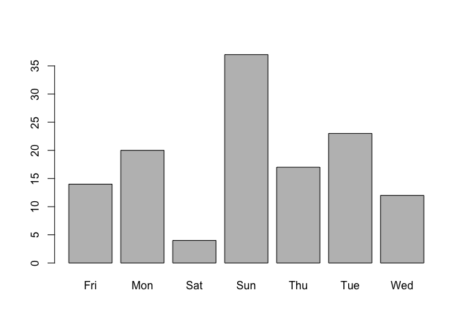
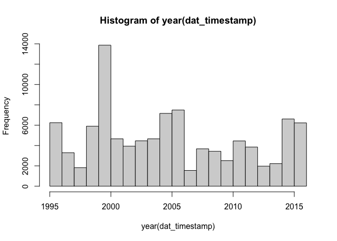

Assignment-1
================
Anurag Garg
2022-12-29

This assessment reviews several concepts about dates, times, and text
mining. In part 1 on this page, you will practice extracting and
manipulating dates in real datasets. In part 2 on the next page, you
will walk through a sentiment analysis of a novel using steps covered in
the previous section.

Use the following libraries and options for coding questions:

``` r
library(tidyverse)
```

    ## ── Attaching packages ─────────────────────────────────────── tidyverse 1.3.2 ──
    ## ✔ ggplot2 3.4.0      ✔ purrr   1.0.0 
    ## ✔ tibble  3.1.8      ✔ dplyr   1.0.10
    ## ✔ tidyr   1.2.1      ✔ stringr 1.5.0 
    ## ✔ readr   2.1.3      ✔ forcats 0.5.2 
    ## ── Conflicts ────────────────────────────────────────── tidyverse_conflicts() ──
    ## ✖ dplyr::filter() masks stats::filter()
    ## ✖ dplyr::lag()    masks stats::lag()

``` r
library(dplyr)
library(dslabs)
library(lubridate)
```

    ## Loading required package: timechange
    ## 
    ## Attaching package: 'lubridate'
    ## 
    ## The following objects are masked from 'package:base':
    ## 
    ##     date, intersect, setdiff, union

``` r
options(digits = 3)    # 3 significant digits
```

IMPORTANT: Some of these exercises use *dslabs* datasets that were added
in a July 2019 update.

## Question 2

Which of the following commands could convert this string into the
correct date format?

``` r
dates <- c("09-01-02", "01-12-07", "02-03-04")

# Answer
class(mdy(dates))
```

    ## [1] "Date"

``` r
class(ymd(dates))
```

    ## [1] "Date"

``` r
class(dmy(dates))
```

    ## [1] "Date"

## Question 3

Load the brexit_polls data frame from dslabs:

``` r
data(brexit_polls)
```

### Question 3.1

How many polls had a start date (startdate) in April (month number 4)?

``` r
dat_month <- brexit_polls %>%
    filter(as.numeric(month(brexit_polls$startdate)) == 4)
nrow(dat_month)
```

    ## [1] 25

Use the round_date() function on the enddate column with the argument
unit=“week”. How many polls ended the week of 2016-06-12?

``` r
dat_week <- brexit_polls %>%
    filter(round_date(brexit_polls$enddate, unit = 'week') == '2016-06-12')
nrow(dat_week)
```

    ## [1] 13

### Question 4

Use the weekdays() function from lubridate to determine the weekday on
which each poll ended (enddate). On which weekday did the greatest
number of polls end?

``` r
plot(as.factor(weekdays(brexit_polls$enddate, abbreviate = TRUE)))
```

<!-- -->

## Question 5

Load the movielens data frame from dslabs.

``` r
data(movielens)
```

This data frame contains a set of about 100,000 movie reviews. The
timestamp column contains the review date as the number of seconds since
1970-01-01 (epoch time).

Convert the timestamp column to dates using the lubridate as_datetime()
function. Which year had the most movie reviews?

``` r
dat_timestamp <- as_datetime(movielens$timestamp)
hist(year(dat_timestamp))
```

<!-- -->

Which hour of the day had the most movie reviews?

``` r
hour_freq <- as.data.frame(table(hour(dat_timestamp)))
hour_freq %>% filter(hour_freq$Freq == max(hour_freq$Freq))
```

    ##   Var1 Freq
    ## 1   20 7011

# Assessment Part 2

In this part of the assessment, you will walk through a basic text
mining and sentiment analysis task.

Project Gutenberg is a digital archive of public domain books. The R
package gutenbergr facilitates the importation of these texts into R. We
will combine this with the tidyverse and tidytext libraries to practice
text mining.

Use these libraries and options:

``` r
library(tidyverse)
library(devtools)
```

    ## Loading required package: usethis

``` r
# install_github("cran/gutenbergr")
library(gutenbergr)
library(tidytext)
options(digits = 3)
```

You can see the books and documents available in gutenbergr like this:

``` r
gutenberg_metadata
```

    ## # A tibble: 69,199 × 8
    ##    gutenberg_id title              author guten…¹ langu…² guten…³ rights has_t…⁴
    ##           <int> <chr>              <chr>    <int> <chr>   <chr>   <chr>  <lgl>  
    ##  1            1 "The Declaration … Jeffe…    1638 en      Politi… Publi… TRUE   
    ##  2            2 "The United State… Unite…       1 en      Politi… Publi… TRUE   
    ##  3            3 "John F. Kennedy'… Kenne…    1666 en      <NA>    Publi… TRUE   
    ##  4            4 "Lincoln's Gettys… Linco…       3 en      US Civ… Publi… TRUE   
    ##  5            5 "The United State… Unite…       1 en      United… Publi… TRUE   
    ##  6            6 "Give Me Liberty … Henry…       4 en      Americ… Publi… TRUE   
    ##  7            7 "The Mayflower Co… <NA>        NA en      <NA>    Publi… TRUE   
    ##  8            8 "Abraham Lincoln'… Linco…       3 en      US Civ… Publi… TRUE   
    ##  9            9 "Abraham Lincoln'… Linco…       3 en      US Civ… Publi… TRUE   
    ## 10           10 "The King James V… <NA>        NA en      Banned… Publi… TRUE   
    ## # … with 69,189 more rows, and abbreviated variable names ¹​gutenberg_author_id,
    ## #   ²​language, ³​gutenberg_bookshelf, ⁴​has_text

## Question 6

Use str_detect() to find the ID of the novel Pride and Prejudice. How
many different ID numbers are returned?

``` r
dat_id_pp <- gutenberg_metadata %>% 
    filter(str_detect(gutenberg_metadata$title, 'Pride and Prejudice'))
dat_id_pp
```

    ## # A tibble: 6 × 8
    ##   gutenberg_id title               author guten…¹ langu…² guten…³ rights has_t…⁴
    ##          <int> <chr>               <chr>    <int> <chr>   <chr>   <chr>  <lgl>  
    ## 1         1342 Pride and Prejudice Auste…      68 en      Best B… Publi… TRUE   
    ## 2        20686 Pride and Prejudice Auste…      68 en      Best B… Publi… FALSE  
    ## 3        20687 Pride and Prejudice Auste…      68 en      Harvar… Publi… FALSE  
    ## 4        26301 Pride and Prejudice Auste…      68 en      Best B… Publi… FALSE  
    ## 5        37431 Pride and Prejudic… <NA>        NA en      <NA>    Publi… TRUE   
    ## 6        42671 Pride and Prejudice Auste…      68 en      Best B… Publi… TRUE   
    ## # … with abbreviated variable names ¹​gutenberg_author_id, ²​language,
    ## #   ³​gutenberg_bookshelf, ⁴​has_text

## Question 7

Notice that there are several versions of the book. The
gutenberg_works() function filters this table to remove replicates and
include only English language works. Use this function to find the ID
for Pride and Prejudice. What is the correct ID number?

``` r
gutenberg_en <- gutenberg_works(languages = 'en')
gutenberg_en %>% 
    filter(str_detect(gutenberg_en$title, 'Pride and Prejudice'))
```

    ## # A tibble: 2 × 8
    ##   gutenberg_id title               author guten…¹ langu…² guten…³ rights has_t…⁴
    ##          <int> <chr>               <chr>    <int> <chr>   <chr>   <chr>  <lgl>  
    ## 1         1342 Pride and Prejudice Auste…      68 en      Best B… Publi… TRUE   
    ## 2        37431 Pride and Prejudic… <NA>        NA en      <NA>    Publi… TRUE   
    ## # … with abbreviated variable names ¹​gutenberg_author_id, ²​language,
    ## #   ³​gutenberg_bookshelf, ⁴​has_text

## Question 8

Use the gutenberg_download() function to download the text for Pride and
Prejudice. Use the tidytext package to create a tidy table with all the
words in the text. Save this object as words.

How many words are present in the book?

``` r
pp <- gutenberg_download(gutenberg_id = 1342)
```

    ## Determining mirror for Project Gutenberg from https://www.gutenberg.org/robot/harvest

    ## Using mirror http://aleph.gutenberg.org

``` r
words <- pp %>% unnest_tokens(word, text)
words
```

    ## # A tibble: 127,996 × 2
    ##    gutenberg_id word        
    ##           <int> <chr>       
    ##  1         1342 illustration
    ##  2         1342 george      
    ##  3         1342 allen       
    ##  4         1342 publisher   
    ##  5         1342 156         
    ##  6         1342 charing     
    ##  7         1342 cross       
    ##  8         1342 road        
    ##  9         1342 london      
    ## 10         1342 ruskin      
    ## # … with 127,986 more rows

## Question 9

Remove stop words from the words object. Recall that stop words are
defined in the stop_words data frame from the tidytext package. How many
words remain?

``` r
words_stop_words <- words %>%
    filter(!words$word %in% stop_words$word)
nrow(words_stop_words)
```

    ## [1] 39698

## Question 10

After removing stop words, detect and then filter out any token that
contains a digit from words. How many words remain?

``` r
words_sp_num <- words_stop_words %>% 
    filter(str_detect(words_stop_words$word, '.?\\d.?', negate = TRUE))
nrow(words_sp_num)
```

    ## [1] 39554

## Question 11

Analyze the most frequent words in the novel after removing stop words
and tokens with digits. How many words appear more than 100 times in the
book?

``` r
final_words <- data.frame(table(words_sp_num$word))
final_words %>%
    filter(final_words$Freq > 100) %>%
    nrow
```

    ## [1] 25

What is the most common word in the book? How many times does that most
common word appear?

``` r
final_words %>%
    filter(final_words$Freq == max(final_words$Freq))
```

    ##        Var1 Freq
    ## 1 elizabeth  605

## Question 12

Define the afinn lexicon:

``` r
afinn <- get_sentiments("afinn")
```

Note that this command will trigger a question in the R Console asking
if you want to download the AFINN lexicon. Press 1 to select “Yes” (if
using RStudio, enter this in the Console tab).

Use this afinn lexicon to assign sentiment values to words. Keep only
words that are present in both words and the afinn lexicon. Save this
data frame as afinn_sentiments. How many elements of `words` have
sentiments in the afinn lexicon?

``` r
afinn_sentiments <- words %>% inner_join(afinn, by = "word") %>%
    select(c(word, value))
nrow(afinn_sentiments)
```

    ## [1] 8160

What proportion of words in afinn_sentiments have a positive value?

``` r
mean(afinn_sentiments$value > 0)
```

    ## [1] 0.587

How many elements of afinn_sentiments have a value of 4?

``` r
afinn_sentiments %>% filter(value==4) %>% nrow
```

    ## [1] 55
