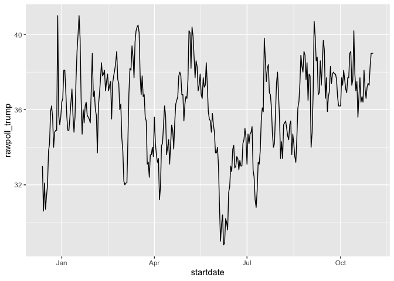

Practice Section - 4
================
Anurag Garg
2022-12-29

## Section 4.1

``` r
# inspect the startdate column of 2016 polls data, a Date type
library(tidyverse)
```

    ## ── Attaching packages ─────────────────────────────────────── tidyverse 1.3.2 ──
    ## ✔ ggplot2 3.4.0      ✔ purrr   1.0.0 
    ## ✔ tibble  3.1.8      ✔ dplyr   1.0.10
    ## ✔ tidyr   1.2.1      ✔ stringr 1.5.0 
    ## ✔ readr   2.1.3      ✔ forcats 0.5.2 
    ## ── Conflicts ────────────────────────────────────────── tidyverse_conflicts() ──
    ## ✖ dplyr::filter() masks stats::filter()
    ## ✖ dplyr::lag()    masks stats::lag()

``` r
library(dslabs)
data("polls_us_election_2016")
polls_us_election_2016$startdate %>% head
```

    ## [1] "2016-11-03" "2016-11-01" "2016-11-02" "2016-11-04" "2016-11-03"
    ## [6] "2016-11-03"

``` r
class(polls_us_election_2016$startdate)
```

    ## [1] "Date"

``` r
as.numeric(polls_us_election_2016$startdate) %>% head
```

    ## [1] 17108 17106 17107 17109 17108 17108

``` r
# ggplot is aware of dates
polls_us_election_2016 %>% filter(pollster == "Ipsos" & state =="U.S.") %>%
  ggplot(aes(startdate, rawpoll_trump)) +
  geom_line()
```

<!-- -->

``` r
# lubridate: the tidyverse date package
library(lubridate)
```

    ## Loading required package: timechange
    ## 
    ## Attaching package: 'lubridate'
    ## 
    ## The following objects are masked from 'package:base':
    ## 
    ##     date, intersect, setdiff, union

``` r
# select some random dates from polls
set.seed(2)
dates <- sample(polls_us_election_2016$startdate, 10) %>% sort
dates
```

    ##  [1] "2016-01-19" "2016-08-06" "2016-08-26" "2016-09-09" "2016-09-14"
    ##  [6] "2016-09-16" "2016-09-29" "2016-10-04" "2016-10-12" "2016-10-23"

``` r
# extract month, day, year from date strings
data.frame(date = dates, 
           month = month(dates),
           day = day(dates),
           year = year(dates))
```

    ##          date month day year
    ## 1  2016-01-19     1  19 2016
    ## 2  2016-08-06     8   6 2016
    ## 3  2016-08-26     8  26 2016
    ## 4  2016-09-09     9   9 2016
    ## 5  2016-09-14     9  14 2016
    ## 6  2016-09-16     9  16 2016
    ## 7  2016-09-29     9  29 2016
    ## 8  2016-10-04    10   4 2016
    ## 9  2016-10-12    10  12 2016
    ## 10 2016-10-23    10  23 2016

``` r
month(dates, label = TRUE)    # extract month label
```

    ##  [1] Jan Aug Aug Sep Sep Sep Sep Oct Oct Oct
    ## 12 Levels: Jan < Feb < Mar < Apr < May < Jun < Jul < Aug < Sep < ... < Dec

``` r
# ymd works on mixed date styles
x <- c(20090101, "2009-01-02", "2009 01 03", "2009-1-4",
       "2009-1, 5", "Created on 2009 1 6", "200901 !!! 07")
ymd(x)
```

    ## [1] "2009-01-01" "2009-01-02" "2009-01-03" "2009-01-04" "2009-01-05"
    ## [6] "2009-01-06" "2009-01-07"

``` r
# different parsers extract year, month and day in different orders
x <- "09/01/02"
ymd(x)
```

    ## [1] "2009-01-02"

``` r
mdy(x)
```

    ## [1] "2002-09-01"

``` r
ydm(x)
```

    ## [1] "2009-02-01"

``` r
myd(x)
```

    ## [1] "2001-09-02"

``` r
dmy(x)
```

    ## [1] "2002-01-09"

``` r
dym(x)
```

    ## [1] "2001-02-09"

``` r
now()    # current time in your time zone
```

    ## [1] "2022-12-29 20:21:10 +04"

``` r
now("GMT")    # current time in GMT
```

    ## [1] "2022-12-29 16:21:10 GMT"

``` r
now() %>% hour()    # current hour
```

    ## [1] 20

``` r
now() %>% minute()    # current minute
```

    ## [1] 21

``` r
now() %>% second()    # current second
```

    ## [1] 10.87043

``` r
# parse time
x <- c("12:34:56")
hms(x)
```

    ## [1] "12H 34M 56S"

``` r
#parse datetime
x <- "Nov/2/2012 12:34:56"
mdy_hms(x)
```

    ## [1] "2012-11-02 12:34:56 UTC"
