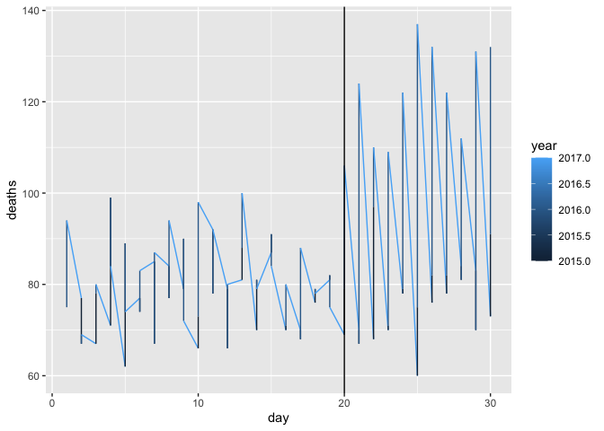

Puerto Rico Hurricane Mortality: Part 1
================
Anurag Garg
2022-12-30

## Question 1

In the extdata directory of the dslabs package, you will find a PDF file
containing daily mortality data for Puerto Rico from Jan 1, 2015 to May
31, 2018. You can find the file like this:

``` r
library(tidyverse)
```

    ## ── Attaching packages ─────────────────────────────────────── tidyverse 1.3.2 ──
    ## ✔ ggplot2 3.4.0      ✔ purrr   1.0.0 
    ## ✔ tibble  3.1.8      ✔ dplyr   1.0.10
    ## ✔ tidyr   1.2.1      ✔ stringr 1.5.0 
    ## ✔ readr   2.1.3      ✔ forcats 0.5.2 
    ## ── Conflicts ────────────────────────────────────────── tidyverse_conflicts() ──
    ## ✖ dplyr::filter() masks stats::filter()
    ## ✖ dplyr::lag()    masks stats::lag()

``` r
fn <- system.file("extdata", "RD-Mortality-Report_2015-18-180531.pdf", package="dslabs")
```

Find and open the file or open it directly from RStudio. On a Mac, you
can type:

``` r
#system2("open", args = fn)
```

## Question 2

We are going to create a tidy dataset with each row representing one
observation. The variables in this dataset will be year, month, day and
deaths.

Use the pdftools package to read in fn using the pdf_text() function.
Store the results in an object called txt. Describe what you see in txt.

``` r
library(pdftools)
```

    ## Using poppler version 22.02.0

``` r
txt = pdf_text(fn)
txt[1]
```

    ## [1] "6/4/2018                                Departamento de Salud - Registro Demográfico - División de Calidad y Estadísticas Vitales\n\n JAN    2015    2016    2017    2018\n    1     107      89     107      95\n    2     101      88     108     107                                                                          Defunciones Ocurridas en Enero por Día y Año\n    3      78      79     115      92\n                                            140\n    4     121      90      81     108\n    5      99      80      79      94\n                                            120\n    6     104      96      90      87\n    7      79      92     116      97\n                                            100\n    8      73      77     108      85\n    9      90      86      81      91\n                                             80\n   10      75      90      85      89\n   11      88      86      77      94\n                                             60\n   12      85      81      75      92\n   13      74      79      84     107\n                                             40\n   14      98      87     103      90\n   15      88      94     104      93\n                                             20\n   16     111      99     103     103\n   17      92      92      85      83\n                                              0\n   18      90      83      94      96\n                                                     1      2     3      4      5     6      7      8      9     10    11   12     13   14   15     16   17     18   19   20   21   22   23   24   25   26   27   28   29   30   31\n   19     101      81      91      75\n   20      98     100      88      99      Fuente: Registro Demográfico - División de Calidad y Estadísticas Vitales             2015        2016        2017         2018\n   21     105      81     102      91\n   22      71      87      90      95\n   23      82      92      95      67\n   24      84     100      87      93\n   25      83      92      96      86\n   26      83      98      94      93\n   27      73      91      81      86\n   28      87      98      99      91\n   29      73      92      97      88\n   30      78      90      97      82\n   31      73      72      82      72\nTotal    2744    2742    2894    2821\nAvg        89      88      93      91\nMax       121     100     116     108     NOTA:\nMin        71      77      75      67     * Año 2017 - Datos preliminares; archivo final en proceso operacional de revisión de calidad y validación.\nMed        88      90      94      92     ** Año 2018 - Datos preliminares; Certificados de Defunción registrados en sistema hasta 5/31/2018.\n"

## Question 3

Extract the ninth page of the PDF file from the object txt, then use the
str_split() function from the stringr package so that you have each line
in a different entry. The new line character is \*. Call this string
vector x. Look at x. What best describes what you see?

``` r
library(stringr)
x <- str_split(txt[9], '\n')
x
```

    ## [[1]]
    ##  [1] "6/4/2018                                         Departamento de Salud - Registro Demográfico - División de Calidad y Estadísticas Vitales"                                                                                            
    ##  [2] ""                                                                                                                                                                                                                                      
    ##  [3] "SEP     2015    2016     2017    2018"                                                                                                                                                                                                 
    ##  [4] "    1      75      75       94          0"                                                                                                                                                                                             
    ##  [5] "    2      77      67       69          0                                                                       Defunciones Ocurridas en Septiembre por Día y Año"                                                                     
    ##  [6] "    3      67      78       80          0"                                                                                                                                                                                             
    ##  [7] "                                              140"                                                                                                                                                                                     
    ##  [8] "    4      71      99       84          0"                                                                                                                                                                                             
    ##  [9] "    5      62      89       74          0"                                                                                                                                                                                             
    ## [10] "                                              120"                                                                                                                                                                                     
    ## [11] "    6      77      74       83          0"                                                                                                                                                                                             
    ## [12] "    7      85      67       87          0"                                                                                                                                                                                             
    ## [13] "    8      84      77       94          0     100"                                                                                                                                                                                     
    ## [14] "    9      79      90       72          0"                                                                                                                                                                                             
    ## [15] "   10      66      73       98          0      80"                                                                                                                                                                                     
    ## [16] "   11      92      78       92          0"                                                                                                                                                                                             
    ## [17] "   12      79      66       80          0      60"                                                                                                                                                                                     
    ## [18] "   13      81      88      100          0"                                                                                                                                                                                             
    ## [19] "   14      70      81       79          0      40"                                                                                                                                                                                     
    ## [20] "   15      87      91       84          0"                                                                                                                                                                                             
    ## [21] "   16      70      71       80          0      20"                                                                                                                                                                                     
    ## [22] "   17      70      68       88          0"                                                                                                                                                                                             
    ## [23] "   18      76      79       78          0       0"                                                                                                                                                                                     
    ## [24] "   19      81      82       75          0              1      2      3       4      5      6       7      8      9       10   11   12   13   14      15   16     17   18    19    20   21   22   23   24   25   26   27   28   29   30"
    ## [25] "   20      69      79      106          0    Fuente: Registro Demográfico - División de Calidad y Estadísticas Vitales              2015          2016         2017        2018"                                                       
    ## [26] "   21      70      67      124          0"                                                                                                                                                                                             
    ## [27] "   22      68      97      110          0"                                                                                                                                                                                             
    ## [28] "   23      70      71      109          0"                                                                                                                                                                                             
    ## [29] "   24      78      79      122          0"                                                                                                                                                                                             
    ## [30] "   25      60      75      137          0"                                                                                                                                                                                             
    ## [31] "   26      76      82      132          0"                                                                                                                                                                                             
    ## [32] "   27      78      82      122          0"                                                                                                                                                                                             
    ## [33] "   28      84      81      112          0"                                                                                                                                                                                             
    ## [34] "   29      83      70      131          0"                                                                                                                                                                                             
    ## [35] "   30      73      91      132          0"                                                                                                                                                                                             
    ## [36] "Total    2258    2367     2928          0"                                                                                                                                                                                             
    ## [37] "Avg        75      79       98          0"                                                                                                                                                                                             
    ## [38] "Max        92      99      137          0   NOTA:"                                                                                                                                                                                     
    ## [39] "Min        60      66       69          0   * Año 2017 - Datos preliminares; archivo final en proceso operacional de revisión de calidad y validación."                                                                                
    ## [40] "Med        76     78.5      93          0   ** Año 2018 - Datos preliminares; Certificados de Defunción registrados en sistema hasta 5/31/2018."                                                                                       
    ## [41] ""

### Question 3.1

What kind of object is `x`?

``` r
class(x)
```

    ## [1] "list"

### Question 3.2

How many entries does `x` have?

``` r
length(x[[1]])
```

    ## [1] 41

## Question 4

Define s to be the first entry of the x object. What kind of object is
s?

``` r
s <- x[[1]]
class(s)
```

    ## [1] "character"

How many entries does s have?

``` r
length(s)
```

    ## [1] 41

## Question 5

When inspecting the string we obtained above, we see a common problem:
white space before and after the other characters. Trimming is a common
first step in string processing. These extra spaces will eventually make
splitting the strings hard so we start by removing them.

We learned about the command str_trim() that removes spaces at the start
or end of the strings. Use this function to trim s and assign the result
to s again. After trimming, what single character is the last character
of element 1 of s?

``` r
s_trim <- str_trim(s)
s_trim[[1]]
```

    ## [1] "6/4/2018                                         Departamento de Salud - Registro Demográfico - División de Calidad y Estadísticas Vitales"

## Question 6

We want to extract the numbers from the strings stored in s. However,
there are a lot of non-numeric characters that will get in the way. We
can remove these, but before doing this we want to preserve the string
with the column header, which includes the month abbreviation.

Use the str_which() function to find the row with the header. Save this
result to header_index. Hint: find the first string that matches the
pattern “2015” using the str_which() function.

What is the value of header_index?

``` r
header_index <- s_trim[str_which(s, '2015')[[1]]]
header_index
```

    ## [1] "SEP     2015    2016     2017    2018"

## Question 7

2 points possible (graded)

We want to extract two objects from the header row: month will store the
month and header will store the column names.

Save the content of the header row into an object called header, then
use str_split() to help define the two objects we need. What is the
value of month?

Use header_index to extract the row. The separator here is one or more
spaces. Also, consider using the simplify argument.

``` r
header_index_list <- str_split(header_index, '     ')[[1]]
month <- header_index_list[[1]]
list1 <- str_split(header_index_list[[2]], '    ')
list2 <- str_split(header_index_list[[3]], '    ')
header <- c(list1[[1]][[1]], list1[[1]][[2]], list2[[1]][[1]], list2[[1]][[2]])
month
```

    ## [1] "SEP"

``` r
header
```

    ## [1] "2015" "2016" "2017" "2018"

What is the third value in header?

``` r
header[[3]]
```

    ## [1] "2017"

# Puerto Rico Hurricane Mortality: Part 2

## Question 8

Notice that towards the end of the page defined by s you see a “Total”
row followed by rows with other summary statistics. Create an object
called tail_index with the index of the “Total” entry. What is the value
of tail_index?

``` r
tail_index <- str_which(s, "Total")
tail_index
```

    ## [1] 36

## Question 9

0.0/1.0 point (graded)

Because our PDF page includes graphs with numbers, some of our rows have
just one number (from the y-axis of the plot). Use the str_count()
function to create an object n with the count of numbers in each row.
How many rows have a single number in them?

``` r
n <- sum(str_detect(s, '\\s{20}\\d{1,10}'))
n
```

    ## [1] 2

## Question 10

We are now ready to remove entries from rows that we know we don’t need.
The entry header_index and everything before it should be removed.
Entries for which n is 1 should also be removed, and the entry
tail_index and everything that comes after it should be removed as well.

How many entries remain in s?

``` r
s_trim <- c(s[(4:6)], s[(8:9)], s[(11:35)])
length(s_trim)
```

    ## [1] 30

## Question 11

1 point possible (graded)

Now we are ready to remove all text that is not a digit or space. Do
this using regular expressions (regex) and the str_remove_all()
function.

In regex, using the ^ inside the square brackets \[\] means not, like
the ! means not in !=. To define the regex pattern to catch all
non-numbers, you can type \[^\\\d\]. But remember you also want to keep
spaces. Which of these commands produces the correct output?

``` r
s_final <- str_remove_all(s_trim, "[^\\d\\s]")
s_final
```

    ##  [1] "    1      75      75       94          0"                                                                                                                                                                                             
    ##  [2] "    2      77      67       69          0                                                                              "                                                                                                               
    ##  [3] "    3      67      78       80          0"                                                                                                                                                                                             
    ##  [4] "    4      71      99       84          0"                                                                                                                                                                                             
    ##  [5] "    5      62      89       74          0"                                                                                                                                                                                             
    ##  [6] "    6      77      74       83          0"                                                                                                                                                                                             
    ##  [7] "    7      85      67       87          0"                                                                                                                                                                                             
    ##  [8] "    8      84      77       94          0     100"                                                                                                                                                                                     
    ##  [9] "    9      79      90       72          0"                                                                                                                                                                                             
    ## [10] "   10      66      73       98          0      80"                                                                                                                                                                                     
    ## [11] "   11      92      78       92          0"                                                                                                                                                                                             
    ## [12] "   12      79      66       80          0      60"                                                                                                                                                                                     
    ## [13] "   13      81      88      100          0"                                                                                                                                                                                             
    ## [14] "   14      70      81       79          0      40"                                                                                                                                                                                     
    ## [15] "   15      87      91       84          0"                                                                                                                                                                                             
    ## [16] "   16      70      71       80          0      20"                                                                                                                                                                                     
    ## [17] "   17      70      68       88          0"                                                                                                                                                                                             
    ## [18] "   18      76      79       78          0       0"                                                                                                                                                                                     
    ## [19] "   19      81      82       75          0              1      2      3       4      5      6       7      8      9       10   11   12   13   14      15   16     17   18    19    20   21   22   23   24   25   26   27   28   29   30"
    ## [20] "   20      69      79      106          0                           2015          2016         2017        2018"                                                                                                                       
    ## [21] "   21      70      67      124          0"                                                                                                                                                                                             
    ## [22] "   22      68      97      110          0"                                                                                                                                                                                             
    ## [23] "   23      70      71      109          0"                                                                                                                                                                                             
    ## [24] "   24      78      79      122          0"                                                                                                                                                                                             
    ## [25] "   25      60      75      137          0"                                                                                                                                                                                             
    ## [26] "   26      76      82      132          0"                                                                                                                                                                                             
    ## [27] "   27      78      82      122          0"                                                                                                                                                                                             
    ## [28] "   28      84      81      112          0"                                                                                                                                                                                             
    ## [29] "   29      83      70      131          0"                                                                                                                                                                                             
    ## [30] "   30      73      91      132          0"

Question 12 0.0/4.0 points (graded)

Use the str_split_fixed function to convert s into a data matrix with
just the day and death count data:

``` r
s <- str_split_fixed(s_final, "\\s+", n = 6)[,1:5]
```

Now you are almost ready to finish. Add column names to the matrix: the
first column should be day and the next columns should be the header.
Convert all values to numeric. Also, add a column with the month. Call
the resulting object tab.

``` r
df <- data.frame(s)
colnames(df) <- append(c("", 'day'), str_split(header, '\\s+')[(1:3)])
tab <- df[(2:5)]
```

What was the mean number of deaths per day in September 2015?

``` r
mean(as.numeric(tab$"2015"))
```

    ## [1] 75.26667

What is the mean number of deaths per day in September 2016?

``` r
mean(as.numeric(tab$"2016"))
```

    ## [1] 78.9

Hurricane María hit Puerto Rico on September 20, 2017. What was the mean
number of deaths per day from September 1-19, 2017, before the hurricane
hit? incorrect

``` r
mean(as.numeric(tab$"2017"[(1:19)]))
```

    ## [1] 83.73684

What was the mean number of deaths per day from September 20-30, 2017,
after the hurricane hit?

``` r
mean(as.numeric(tab$"2017"[(20:30)]))
```

    ## [1] 121.5455

## Question 13

Finish it up by changing tab to a tidy format, starting from this code
outline:

``` r
tab <- tab %>% gather(year, deaths, -day) %>%
    mutate(deaths = as.numeric(deaths))
tab
```

    ##    day year deaths
    ## 1    1 2015     75
    ## 2    2 2015     77
    ## 3    3 2015     67
    ## 4    4 2015     71
    ## 5    5 2015     62
    ## 6    6 2015     77
    ## 7    7 2015     85
    ## 8    8 2015     84
    ## 9    9 2015     79
    ## 10  10 2015     66
    ## 11  11 2015     92
    ## 12  12 2015     79
    ## 13  13 2015     81
    ## 14  14 2015     70
    ## 15  15 2015     87
    ## 16  16 2015     70
    ## 17  17 2015     70
    ## 18  18 2015     76
    ## 19  19 2015     81
    ## 20  20 2015     69
    ## 21  21 2015     70
    ## 22  22 2015     68
    ## 23  23 2015     70
    ## 24  24 2015     78
    ## 25  25 2015     60
    ## 26  26 2015     76
    ## 27  27 2015     78
    ## 28  28 2015     84
    ## 29  29 2015     83
    ## 30  30 2015     73
    ## 31   1 2016     75
    ## 32   2 2016     67
    ## 33   3 2016     78
    ## 34   4 2016     99
    ## 35   5 2016     89
    ## 36   6 2016     74
    ## 37   7 2016     67
    ## 38   8 2016     77
    ## 39   9 2016     90
    ## 40  10 2016     73
    ## 41  11 2016     78
    ## 42  12 2016     66
    ## 43  13 2016     88
    ## 44  14 2016     81
    ## 45  15 2016     91
    ## 46  16 2016     71
    ## 47  17 2016     68
    ## 48  18 2016     79
    ## 49  19 2016     82
    ## 50  20 2016     79
    ## 51  21 2016     67
    ## 52  22 2016     97
    ## 53  23 2016     71
    ## 54  24 2016     79
    ## 55  25 2016     75
    ## 56  26 2016     82
    ## 57  27 2016     82
    ## 58  28 2016     81
    ## 59  29 2016     70
    ## 60  30 2016     91
    ## 61   1 2017     94
    ## 62   2 2017     69
    ## 63   3 2017     80
    ## 64   4 2017     84
    ## 65   5 2017     74
    ## 66   6 2017     83
    ## 67   7 2017     87
    ## 68   8 2017     94
    ## 69   9 2017     72
    ## 70  10 2017     98
    ## 71  11 2017     92
    ## 72  12 2017     80
    ## 73  13 2017    100
    ## 74  14 2017     79
    ## 75  15 2017     84
    ## 76  16 2017     80
    ## 77  17 2017     88
    ## 78  18 2017     78
    ## 79  19 2017     75
    ## 80  20 2017    106
    ## 81  21 2017    124
    ## 82  22 2017    110
    ## 83  23 2017    109
    ## 84  24 2017    122
    ## 85  25 2017    137
    ## 86  26 2017    132
    ## 87  27 2017    122
    ## 88  28 2017    112
    ## 89  29 2017    131
    ## 90  30 2017    132

Make a plot of deaths versus day with color to denote year. Exclude 2018
since we have no data. Add a vertical line at day 20, the day that
Hurricane María hit in 2017.

``` r
tab$day <- as.numeric(tab$day)
tab$year <- as.numeric(tab$year)
tab$deaths <- as.numeric(tab$deaths)
library(ggplot2)
ggplot(tab) + 
    geom_line(aes(day, deaths, color = year)) +
    geom_vline(xintercept = 20)
```

<!-- -->
