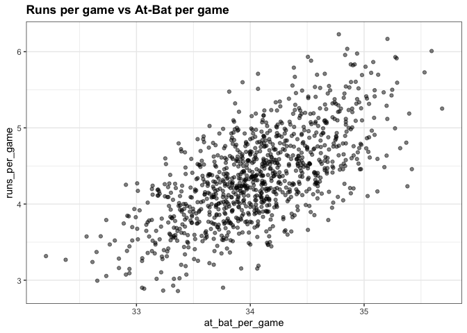
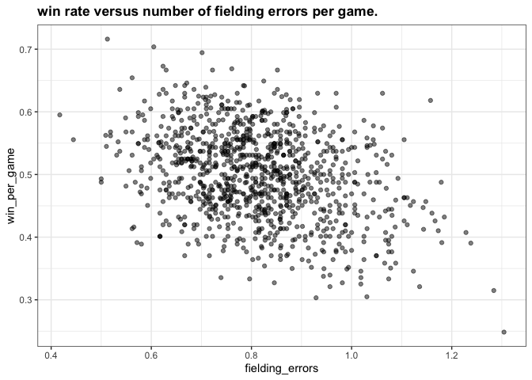
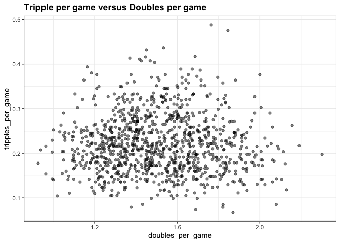

Assignment - 1
================
Anurag Garg
2022-12-30

## Load Library and Data

``` r
library(Lahman)
library(tidyverse)
```

    ## ── Attaching packages ─────────────────────────────────────── tidyverse 1.3.2 ──
    ## ✔ ggplot2 3.4.0      ✔ purrr   1.0.0 
    ## ✔ tibble  3.1.8      ✔ dplyr   1.0.10
    ## ✔ tidyr   1.2.1      ✔ stringr 1.5.0 
    ## ✔ readr   2.1.3      ✔ forcats 0.5.2 
    ## ── Conflicts ────────────────────────────────────────── tidyverse_conflicts() ──
    ## ✖ dplyr::filter() masks stats::filter()
    ## ✖ dplyr::lag()    masks stats::lag()

``` r
library(dslabs)
library(ggplot2)
ds_theme_set()
```

## Question 5

What does the variable “SOA” stand for in the Teams table?

``` r
?Teams
```

## Question 6

Load the Lahman library. Filter the Teams data frame to include years
from 1961 to 2001. Make a scatterplot of runs per game versus at bats
(AB) per game.

Which of the following is true?

``` r
Teams %>% 
    filter(yearID >= 1961 & yearID <= 2001) %>%
    mutate(runs_per_game = R/G, at_bat_per_game = AB/G) %>%
    ggplot(aes(at_bat_per_game, runs_per_game)) +
    geom_point(alpha = 0.5) +
    ggtitle("Runs per game vs At-Bat per game")
```

<!-- -->

## Question 7

Use the filtered Teams data frame from Question 6. Make a scatterplot of
win rate (number of wins per game) versus number of fielding errors (E)
per game.

Which of the following is true?

``` r
Teams %>% 
    filter(yearID >= 1961 & yearID <= 2001) %>%
    mutate(win_per_game = W/G, fielding_errors = E/G) %>%
    ggplot(aes(fielding_errors, win_per_game)) +
    geom_point(alpha = 0.5) +
    ggtitle("win rate versus number of fielding errors per game.")
```

<!-- -->

## Question 8

Use the filtered Teams data frame from Question 6. Make a scatterplot of
triples (X3B) per game versus doubles (X2B) per game.

Which of the following is true?

``` r
Teams %>% 
    filter(yearID >= 1961 & yearID <= 2001) %>%
    mutate(tripples_per_game = X3B/G, doubles_per_game = X2B/G) %>%
    ggplot(aes(doubles_per_game, tripples_per_game)) +
    geom_point(alpha = 0.5) + 
    ggtitle("Tripple per game versus Doubles per game")
```

<!-- -->
