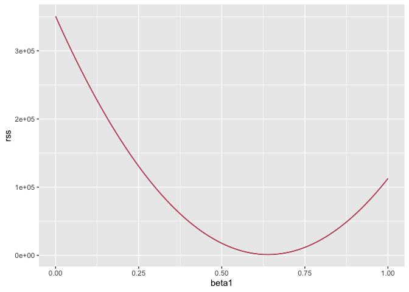
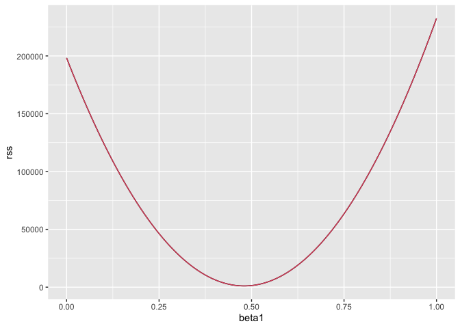
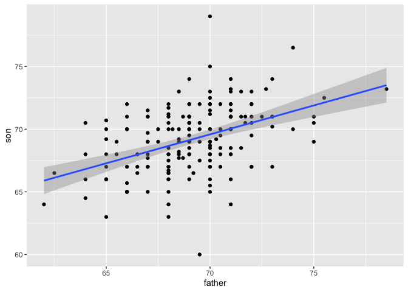

Assignment: Least Square Estimates
================
Anurag Garg
2022-12-30

## Loading Library and Data

``` r
library(tidyverse)
```

    ## ── Attaching packages ─────────────────────────────────────── tidyverse 1.3.2 ──
    ## ✔ ggplot2 3.4.0      ✔ purrr   1.0.0 
    ## ✔ tibble  3.1.8      ✔ dplyr   1.0.10
    ## ✔ tidyr   1.2.1      ✔ stringr 1.5.0 
    ## ✔ readr   2.1.3      ✔ forcats 0.5.2 
    ## ── Conflicts ────────────────────────────────────────── tidyverse_conflicts() ──
    ## ✖ dplyr::filter() masks stats::filter()
    ## ✖ dplyr::lag()    masks stats::lag()

``` r
library(HistData)
data("GaltonFamilies")
set.seed(1983)
galton_heights <- GaltonFamilies %>%
  filter(gender == "male") %>%
  group_by(family) %>%
  sample_n(1) %>%
  ungroup() %>%
  select(father, childHeight) %>%
  rename(son = childHeight)

rss <- function(beta0, beta1){
    resid <- galton_heights$son - (beta0+beta1*galton_heights$father)
    return(sum(resid^2))
}
```

## Question 1

The following code was used in the video to plot RSS with
$\beta_o = 25$.

``` r
beta1 = seq(0, 1, len=nrow(galton_heights))
results <- data.frame(beta1 = beta1,
                      rss = sapply(beta1, rss, beta0 = 25))
results %>% ggplot(aes(beta1, rss)) + geom_line() + 
  geom_line(aes(beta1, rss), col=2)
```

<!-- -->

In a model for sons’ heights vs fathers’ heights, what is the least
squares estimate (LSE) $\beta_1$ for if we assume is
$\hat{\beta_1} = 36$?

``` r
beta1 = seq(0, 1, len=nrow(galton_heights))
results <- data.frame(beta1 = beta1,
                      rss = sapply(beta1, rss, beta0 = 36))
results %>% ggplot(aes(beta1, rss)) + geom_line() + 
  geom_line(aes(beta1, rss), col=2)
```

<!-- -->

``` r
results %>% filter(rss == min(rss)) %>% select(beta1) %>% pull(beta1)
```

    ## [1] 0.4775281

## Question 3

Load the Lahman library and filter the Teams data frame to the years
1961-2001. Mutate the dataset to create variables for bases on balls per
game, runs per game, and home runs per game, then run a linear model in
R predicting the number of runs per game based on both the number of
bases on balls per game and the number of home runs per game.

What is the coefficient for bases on balls per game?

``` r
library(Lahman)
dat <- Teams %>%
    filter(yearID >= 1961 & yearID <= 2001) %>%
    mutate(runs_per_game = R/G, hr_per_game = HR/G, bb_per_game = BB/G) %>%
    select(runs_per_game, hr_per_game, bb_per_game)
head(dat)
```

    ##   runs_per_game hr_per_game bb_per_game
    ## 1      4.239264   0.9141104    3.564417
    ## 2      4.472393   0.6871166    3.969325
    ## 3      4.693252   0.8466258    3.374233
    ## 4      4.416667   1.1282051    3.455128
    ## 5      4.610390   1.0259740    2.746753
    ## 6      4.577640   0.9316770    3.055901

What is the coefficient for bases on balls per game?

``` r
lm(runs_per_game ~ hr_per_game + bb_per_game, data = dat)
```

    ## 
    ## Call:
    ## lm(formula = runs_per_game ~ hr_per_game + bb_per_game, data = dat)
    ## 
    ## Coefficients:
    ## (Intercept)  hr_per_game  bb_per_game  
    ##      1.7443       1.5612       0.3874

## Question 4

1 point possible (graded)

We run a Monte Carlo simulation where we repeatedly take samples of N =
100 from the Galton heights data and compute the regression slope
coefficients for each sample:

``` r
B <- 1000
N <- 100
lse <- replicate(B, {
    sample_n(galton_heights, N, replace = TRUE) %>% 
    lm(son ~ father, data = .) %>% .$coef 
})

lse <- data.frame(beta_0 = lse[1,], beta_1 = lse[2,]) 
head(lse)
```

    ##     beta_0    beta_1
    ## 1 35.27120 0.4869812
    ## 2 49.45245 0.2843954
    ## 3 40.40733 0.4154510
    ## 4 47.28116 0.3181638
    ## 5 43.08826 0.3731831
    ## 6 33.49507 0.5143937

## Question 5

Which R code(s) below would properly plot the predictions and confidence
intervals for our linear model of sons’ heights?

``` r
galton_heights %>% ggplot(aes(father, son)) +
    geom_point() +
    geom_smooth(method = "lm")
```

    ## `geom_smooth()` using formula = 'y ~ x'

<!-- -->
