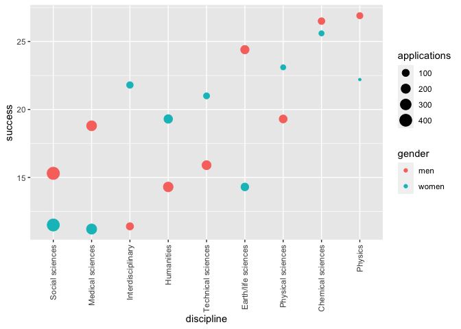
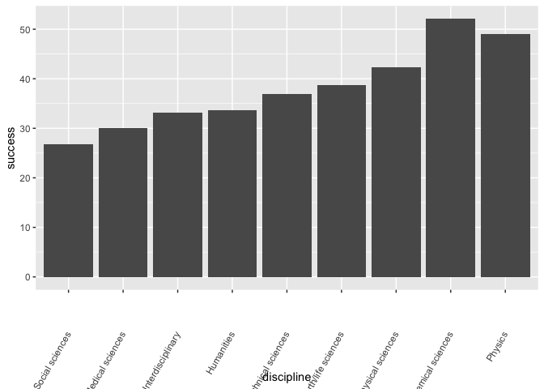

Assessment: Confounding
================
Anurag Garg
2023-01-29

## Introduction

For this set of exercises, we examine the data from a 2014 PNAS paper
that analyzed success rates from funding agencies in the Netherlands
External link and concluded:

“our results reveal gender bias favoring male applicants over female
applicants in the prioritization of their”quality of researcher” (but
not “quality of proposal”) evaluations and success rates, as well as in
the language used in instructional and evaluation materials.”

A response was published a few months later titled No evidence that
gender contributes to personal research funding success in The
Netherlands: A reaction to Van der Lee and Ellemers External link, which
concluded:

However, the overall gender effect borders on statistical significance,
despite the large sample. Moreover, their conclusion could be a prime
example of Simpson’s paradox; if a higher percentage of women apply for
grants in more competitive scientific disciplines (i.e., with low
application success rates for both men and women), then an analysis
across all disciplines could incorrectly show “evidence” of gender
inequality.

Who is right here: the original paper or the response? Here, you will
examine the data and come to your own conclusion.

The main evidence for the conclusion of the original paper comes down to
a comparison of the percentages. The information we need was originally
in Table S1 in the paper, which we include in dslabs:

``` r
library(tidyverse)
```

    ## ── Attaching packages ─────────────────────────────────────── tidyverse 1.3.2 ──
    ## ✔ ggplot2 3.4.0      ✔ purrr   1.0.0 
    ## ✔ tibble  3.1.8      ✔ dplyr   1.0.10
    ## ✔ tidyr   1.2.1      ✔ stringr 1.5.0 
    ## ✔ readr   2.1.3      ✔ forcats 0.5.2 
    ## ── Conflicts ────────────────────────────────────────── tidyverse_conflicts() ──
    ## ✖ dplyr::filter() masks stats::filter()
    ## ✖ dplyr::lag()    masks stats::lag()

``` r
library(dslabs)
data("research_funding_rates")
research_funding_rates
```

    ##            discipline applications_total applications_men applications_women
    ## 1   Chemical sciences                122               83                 39
    ## 2   Physical sciences                174              135                 39
    ## 3             Physics                 76               67                  9
    ## 4          Humanities                396              230                166
    ## 5  Technical sciences                251              189                 62
    ## 6   Interdisciplinary                183              105                 78
    ## 7 Earth/life sciences                282              156                126
    ## 8     Social sciences                834              425                409
    ## 9    Medical sciences                505              245                260
    ##   awards_total awards_men awards_women success_rates_total success_rates_men
    ## 1           32         22           10                26.2              26.5
    ## 2           35         26            9                20.1              19.3
    ## 3           20         18            2                26.3              26.9
    ## 4           65         33           32                16.4              14.3
    ## 5           43         30           13                17.1              15.9
    ## 6           29         12           17                15.8              11.4
    ## 7           56         38           18                19.9              24.4
    ## 8          112         65           47                13.4              15.3
    ## 9           75         46           29                14.9              18.8
    ##   success_rates_women
    ## 1                25.6
    ## 2                23.1
    ## 3                22.2
    ## 4                19.3
    ## 5                21.0
    ## 6                21.8
    ## 7                14.3
    ## 8                11.5
    ## 9                11.2

## Q1

Construct a two-by-two table of gender (men/women) by award status
(awarded/not) using the total numbers across all disciplines.

What is the number of men not awarded?

``` r
research_funding_rates %>%
    summarise(men_total = sum(applications_men),
              men_awarded = sum(awards_men),
              men_not_awarded = sum(applications_men) - sum(awards_men),
              women_total = sum(applications_women),
              women_awarded = sum(awards_women),
              women_not_awarded = sum(applications_women) - sum(awards_women)
              )
```

    ##   men_total men_awarded men_not_awarded women_total women_awarded
    ## 1      1635         290            1345        1188           177
    ##   women_not_awarded
    ## 1              1011

## Q2

Use the two-by-two table from Question 1 to compute the percentages of
men awarded versus women awarded.

What is the percentage of men awarded? Report a percentage between 0 and
100 including 1 decimal place. Do NOT include the percent symbol (%).

``` r
research_funding_rates %>%
    summarise(men_award_percent = sum(awards_men) * 100 / sum(applications_men),
              women_award_percent = sum(awards_women) * 100 / sum(applications_women)
    )
```

    ##   men_award_percent women_award_percent
    ## 1            17.737            14.89899

## Q3

Run a chi-squared test External link on the two-by-two table to
determine whether the difference in the two funding awarded rates is
significant. (You can use tidy() to turn the output of chisq.test() into
a data frame as well.)

What is the p-value of the difference in funding awarded rate?

``` r
summary_table <- research_funding_rates %>%
    summarise(awarded_men = sum(awards_men),
              not_awarded_men = sum(applications_men) - sum(awards_men),
              awarded_women = sum(awards_women),
              not_awarded_women = sum(applications_women) - sum(awards_women)
              )
two_by_two <- data.frame(awarded = c("no", "yes"), 
                         men = c(summary_table$not_awarded_men, summary_table$awarded_men),
                         women = c(summary_table$not_awarded_women, summary_table$awarded_women))
chisq_test <- two_by_two |> select(-awarded) |> chisq.test()
chisq_test
```

    ## 
    ##  Pearson's Chi-squared test with Yates' continuity correction
    ## 
    ## data:  select(two_by_two, -awarded)
    ## X-squared = 3.8111, df = 1, p-value = 0.05091

## Q4

There may be an association between gender and funding. But can we infer
causation here? Is gender bias causing this observed difference? The
response to the original paper claims that what we see here is similar
to the UC Berkeley admissions example. Specifically they state that this
“could be a prime example of Simpson’s paradox; if a higher percentage
of women apply for grants in more competitive scientific disciplines,
then an analysis across all disciplines could incorrectly show
‘evidence’ of gender inequality.”

To settle this dispute, use this dataset with number of applications,
awards, and success rate for each gender:

``` r
dat <- research_funding_rates %>% 
      mutate(discipline = reorder(discipline, success_rates_total)) %>%
      rename(success_total = success_rates_total,
             success_men = success_rates_men,
             success_women = success_rates_women) %>%
      pivot_longer(-discipline) %>%
      separate(name, c("type", "gender")) %>%
      pivot_wider(names_from = type, values_from = value) %>%
      filter(gender != "total")
dat
```

    ## # A tibble: 18 × 5
    ##    discipline          gender applications awards success
    ##    <fct>               <chr>         <dbl>  <dbl>   <dbl>
    ##  1 Chemical sciences   men              83     22    26.5
    ##  2 Chemical sciences   women            39     10    25.6
    ##  3 Physical sciences   men             135     26    19.3
    ##  4 Physical sciences   women            39      9    23.1
    ##  5 Physics             men              67     18    26.9
    ##  6 Physics             women             9      2    22.2
    ##  7 Humanities          men             230     33    14.3
    ##  8 Humanities          women           166     32    19.3
    ##  9 Technical sciences  men             189     30    15.9
    ## 10 Technical sciences  women            62     13    21  
    ## 11 Interdisciplinary   men             105     12    11.4
    ## 12 Interdisciplinary   women            78     17    21.8
    ## 13 Earth/life sciences men             156     38    24.4
    ## 14 Earth/life sciences women           126     18    14.3
    ## 15 Social sciences     men             425     65    15.3
    ## 16 Social sciences     women           409     47    11.5
    ## 17 Medical sciences    men             245     46    18.8
    ## 18 Medical sciences    women           260     29    11.2

To check if this is a case of Simpson’s paradox, plot the success rates
versus disciplines, which have been ordered by overall success, with
colors to denote the genders and size to denote the number of
applications.

In which fields do men have a higher success rate than women?

``` r
dat %>% 
    ggplot(aes(discipline, success, col = gender, size = applications)) +
    geom_point() +
    theme(axis.text.x = element_text(angle = 90, vjust = 0.5, hjust=1))
```

<!-- -->

``` r
dat %>%
    group_by(discipline) %>%
    summarise(total=sum(applications), success=sum(success)) %>%
    ggplot(aes(x=discipline, y=success)) +
    geom_bar(stat="identity") +
    theme(axis.text.x = element_text(angle = 60, vjust = 0.5, hjust=1))
```

<!-- -->
